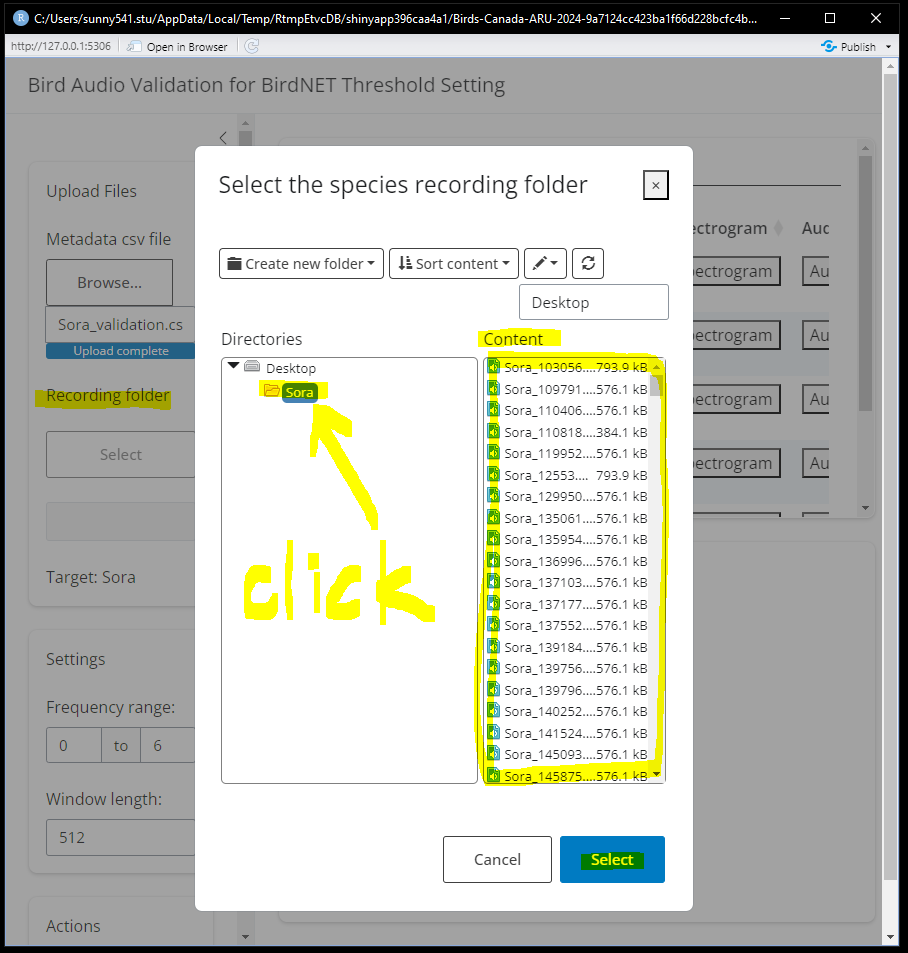
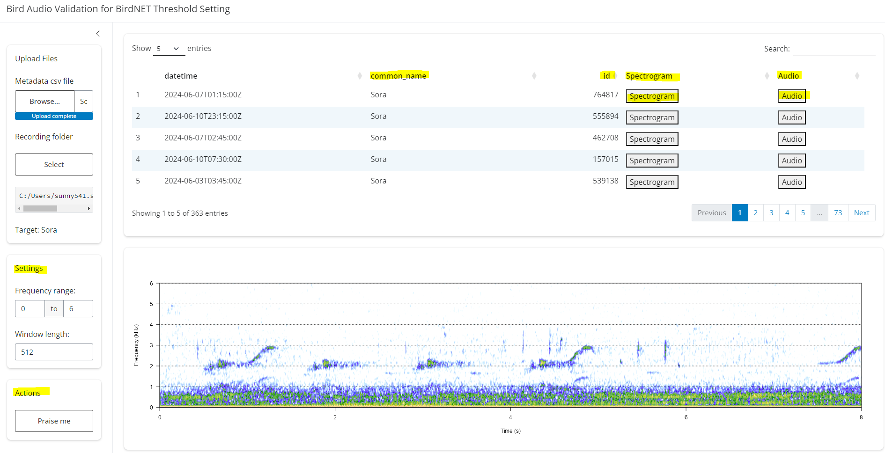

```{r setup, include=FALSE}
knitr::opts_chunk$set(echo = TRUE)
```

## Background

After processing audio files with BirdNET, a detection table is generated that includes the file name, start time, end time, detected species name, and a confidence score ranging from 0.1 to 1, which indicates the likelihood of detection accuracy. However, there is no established threshold for users to determine which detections to trust. A high threshold can increase precision but may exclude valid detections, while a low threshold retains more detections but may reduce precision. To identify a species-specific threshold, users can create a calibration curve linking BirdNET confidence scores to true positive probabilities, but this requires a validated dataset.

To address this need, we developed an R Shiny app that simplifies the process of validating BirdNET predictions by helping users determine whether a prediction is a true positive or a false positive. The Shiny app provides an intuitive interface that allows users to easily listen to the recordings or view spectrograms across all selected BirdNET recording segments, facilitating a more efficient validation process.

## Usage

1.  Call all required libraries

```{r eval = FALSE}
# use install.packages("PACKAGE_NAME") if you don't have the following required packages installed yet

library(shiny) 
library(bslib)
library(shinyWidgets) 
library(shinyFiles)

library(tidyverse)
library(DT)
library(praise)

library(tuneR)
library(seewave)
```

2.  Run the ShinyApp

```{r eval = FALSE}
shiny::runGitHub("BirdNET_validation", "SunnyTseng")
```

3.  An interface should pop up if all goes well. This interface required two entries:
    -   The .csv file that contains the meta data of the segments. This should be a .csv file containing selected BirdNET predictions for validation

    -   The file path of the folder that contains the recording segments.

| select meta data                     | select recording folder              |
|------------------------------------|------------------------------------|
|  |  |

4.  The .csv file would be shown on the top panel (with few selected columns). Once you click on the “Spectrogram” button, the bottom panel would show the corresponded spectrogram. And if you click the “Audio” button, it would play that specific segment for you.

5.  You can adjust the “Settings” on the left panel to view the spectrogram. Click on the “Praise me” button if you are feeling tired of validating sounds. 😃



6.  Enjoy listening 🐦
